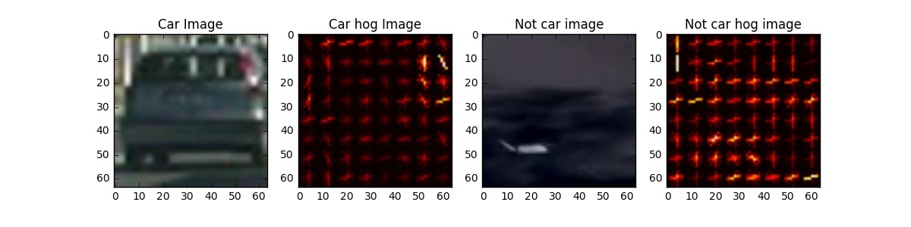
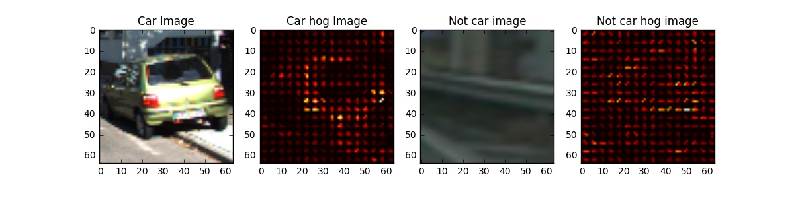
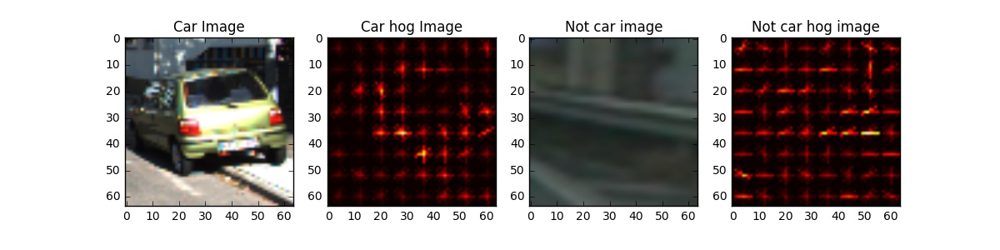
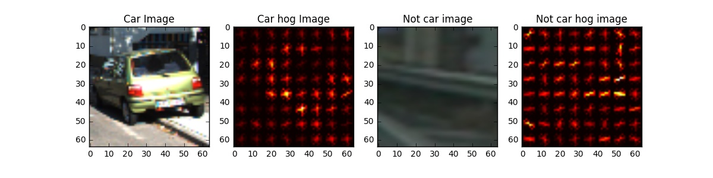
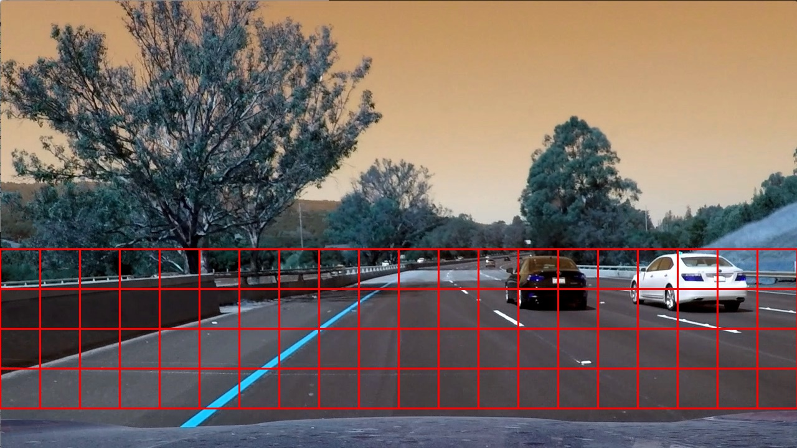
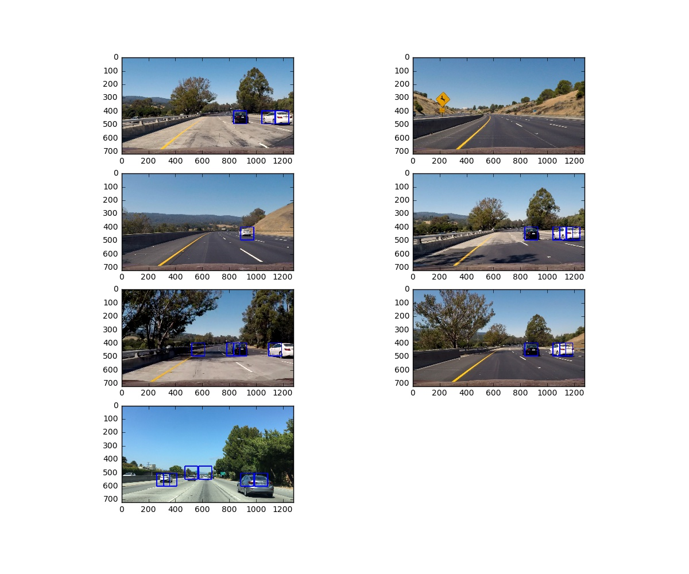
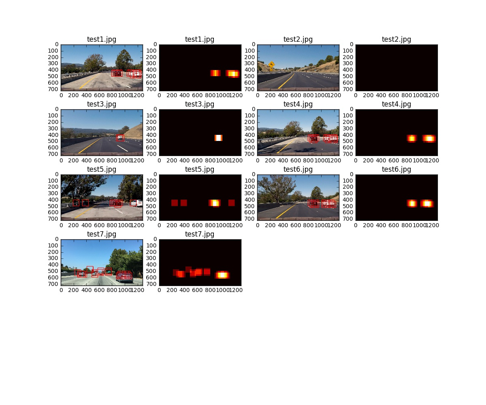

###Writeup / README

###Histogram of Oriented Gradients (HOG)

####1. Explain how (and identify where in your code) you extracted HOG features from the training images.

The code for this step is contained in the second code cell of the IPython notebook Vehicle Detection.ipynb

I started by reading in all the `vehicle` and `non-vehicle` images.  Here is an example of one of each of the `vehicle` and `non-vehicle` classes along with the histogram of oriented gradients.

Params : 6 orientations, 4px per cell and 2 cells per block

Params : 6 orientations, 8px per cell and 2 cells per block

Params : 9 orientations, 8px per cell and 2 cells per block

   * Tried different parameters for orientations : 6, 8, 9
   * Tried different parameters for pixel per cell : 4, 8
   * Tried different parameters for cell per block  : 2, 4

####2. Explain how you settled on your final choice of HOG parameters.

After trying multiple parameters 9 for orientation, 8 pixel per cell and 2 cell per block were able to identify cars better.

####3. Describe how (and identify where in your code) you trained a classifier using your selected HOG features (and color features if you used them).

Extract feature by spatial binning, color histogram and hog features and normalize all the features using scikit StandardScaler. Use the basic Linear SVC classifier which gives us around ~99% test accuracy. 

###Sliding Window Search

####1. Describe how (and identify where in your code) you implemented a sliding window search.  How did you decide what scales to search and how much to overlap windows?

One could start by searching all the possible image locations and different  possible scales for identifying the car but that will be too slow.
Also searching over all possible options would result in false positive and one way to avoid it would be searching the lower half of the image where cars are actually found.

####2. Show some examples of test images to demonstrate how your pipeline is working.  What did you do to optimize the performance of your classifier?

   * Computing Hog feature only once over the image and then extracting features for sub images
   * Avoiding false positives by searching windows but eliminating the top half of the image.
   * Aggregating heatmaps and applying threshold as necessary.

---

### Video Implementation

####1. Provide a link to your final video output.  Your pipeline should perform reasonably well on the entire project video (somewhat wobbly or unstable bounding boxes are ok as long as you are identifying the vehicles most of the time with minimal false positives.)
Here's a [link to my video result](https://youtu.be/rRqwSsyJNAg)

####2. Describe how (and identify where in your code) you implemented some kind of filter for false positives and some method for combining overlapping bounding boxes.

I recorded the positions of positive detections in each frame of the video.  From the positive detections I created a heatmap and then thresholded that map to identify vehicle positions.  I then used `scipy.ndimage.measurements.label()` to identify individual blobs in the heatmap.  I then assumed each blob corresponded to a vehicle.  I constructed bounding boxes to cover the area of each blob detected.  

Here's an example result showing the heatmap from a series of frames of video, the result of `scipy.ndimage.measurements.label()` and the bounding boxes then overlaid on the last frame of video:

### Here are images and their corresponding heatmaps:

---

###Discussion

####1. Briefly discuss any problems / issues you faced in your implementation of this project.  Where will your pipeline likely fail?  What could you do to make it more robust?

First problem was slowness which was resolved by reducing the search space and identifying the hog feature only once.

False positives: Resolved by taking mean of the last 10 heatmaps and applying thresholds

I see similarity to the way we did convolution neural network. Where we move few pixel at a time. Probably another way to get the features is using the the last layer before classification for identifying the car. 